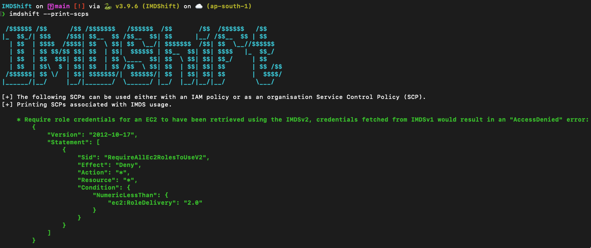

# IMDShift

AWS workloads that rely on the metadata endpoint are vulnerable to Server-Side Request Forgery (SSRF) attacks. IMDShift automates the migration process of all workloads to IMDSv2 with extensive capabilities, which implements enhanced security measures to protect against these attacks.



## Features
* Detection of AWS workloads that rely on the metadata endpoint amongst various services which includes - EC2, ECS, EKS, Lightsail, AutoScaling Groups, Beanstalk (in progress), Sagemaker Notebooks (in progress)
* Simple and intuitive command-line interface for easy usage
* Automated migration of all workloads to IMDSv2
* Standalone hop limit update for compatible resources
* Standalone metadata endpoint enable operation for compatible resources
* Detailed logging of migration process

## IMDShift vs. Metabadger

[Metabadger](https://github.com/salesforce/metabadger) is an older tool that was used to facilitate migration of AWS EC2 workloads to IMDSv2.

IMDShift makes several improvements on Metabadger's capabilities:
* IMDShift allows migration of standalone services and not all EC2 instances, blindly. For example, the user can choose to only migrate EKS workloads, also some services such as Lightsail, do not fall under EC2 umbrella, IMDShift has the capability to migrate such resources as well.
* IMDShift allows standalone enabling of metadata endpoint for resources it is currently disabled, without having perform migration on the remaining resources
* IMDShift allows standalone update response hop limit for resources where metadata endpoint is enabled, without having to perform migration on the remaining resources
* IMDShift allows, not only the option to include specific regions, but also skip specified regions
* IMDShift not only allows usage of AWS profiles, but also can assume roles, to work

## Installation

### Production Installation

```sh
git clone https://github.com/ayushpriya10/imdshift.git
cd imdshift/
python3 -m pip install .
```

### Development Installation

```sh
git clone https://github.com/ayushpriya10/imdshift.git
cd imdshift/
python3 -m pip install -e .
```

## Usage

```
Options:
  --services TEXT             This flag specifies services scan for IMDSv1
                              usage from [EC2, Sagemaker, ASG (Auto Scaling
                              Groups), Lightsail, ECS, EKS, Beanstalk].
                              Format: "--services EC2,Sagemaker,ASG"

  --include-regions TEXT      This flag specifies regions explicitly to
                              include scan for IMDSv1 usage. Format: "--
                              include-regions ap-south-1,ap-southeast-1"

  --exclude-regions TEXT      This flag specifies regions to exclude from the
                              scan explicitly. Format: "--exclude-regions ap-
                              south-1,ap-southeast-1"

  --migrate                   This boolean flag enables IMDShift to perform
                              the migration, defaults to "False". Format: "--
                              migrate"

  --update-hop-limit INTEGER  This flag specifies if the hop limit should be
                              updated and with what value. It is recommended
                              to set the hop limit to "2" to enable containers
                              to be able to work with the IMDS endpoint. If
                              this flag is not passed, hop limit is not
                              updated during migration. Format: "--update-hop-
                              limit 3"

  --enable-imds               This boolean flag enables IMDShift to enable the
                              metadata endpoint for resources that have it
                              disabled and then perform the migration,
                              defaults to "False". Format: "--enable-imds"

  --profile TEXT              This allows you to use any profile from your
                              ~/.aws/credentials file. Format: "--profile
                              prod-env"
                              
  --role-arn TEXT             This flag let's you assume a role via AWS STS.
                              Format: "--role-arn
                              arn:aws:sts::111111111:role/John"

  --print-scps                This boolean flag prints Service Control
                              Policies (SCPs) that can be used to control IMDS
                              usage, like deny access for credentials fetched
                              from IMDSv2 or deny creation of resources with
                              IMDSv1, defaults to "False". Format: "--print-
                              scps"

  --check-imds-usage          This boolean flag launches a scan to identify
                              how many instances are using IMDSv1 in specified
                              regions, during the last 30 days, by using the
                              "MetadataNoToken" CloudWatch metric, defaults to
                              "False". Format: "--check-imds-usage"

  --help                      Show this message and exit.
```